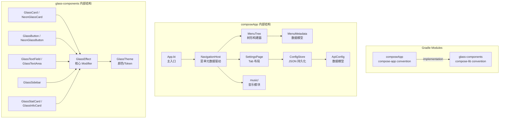

# 设计文档

## 概述

本设计将 Vibepocket 应用进行三大模块升级：

1. **水玻璃组件库子模块化**：将外部 `compose-native-component-glass` 依赖替换为项目内 Gradle 子模块 `glass-components`，修复 Desktop JVM 无原生模糊的渲染问题，并对齐 Apple Liquid Glass 设计语言的视觉风格（半透明层叠、光折射边框高光、深色底层保证可读性）。
2. **树形菜单元数据系统**：将硬编码的侧边栏菜单重构为 `MenuMetadata` 驱动的树形结构，支持虚拟父节点分组、可见性控制、排序，并为未来元编程/低代码填充预留接口。
3. **设置页面**：新增按模块分 Tab 的设置页面，用户可配置各模块的 API Key 和 URL，配置通过 JSON 文件持久化到本地。

设计决策要点：
- 配置持久化选择 **kotlinx.serialization + 本地 JSON 文件**，而非 DataStore。原因：项目当前目标平台包含 Desktop JVM 和 wasmJs，DataStore 对这些平台的支持不够成熟；JSON 文件方案简单、跨平台一致、易于调试。
- 组件库作为独立 Gradle 子模块，使用已有的 `compose-lib` convention plugin，确保可独立发布。
- 菜单元数据使用扁平列表 + parentRouteKey 引用构建树，而非嵌套数据结构，便于序列化和未来从注解处理器生成。

## 架构



## 组件与接口

### 1. glass-components 子模块

**模块路径**: `glass-components/`
**Convention Plugin**: `site.addzero.conventions.compose-lib`
**包名**: `site.addzero.component.glass`

#### GlassTheme（颜色与 Token 系统）

```kotlin
object GlassTheme {
    // 背景层
    val DarkBackground = Color(0xFF0F0F13)
    val DarkSurface = Color(0xFF1E1E26)
    
    // 玻璃表面
    val GlassSurface = Color(0x1AFFFFFF)       // 10% 白
    val GlassSurfaceHover = Color(0x26FFFFFF)   // 15% 白
    val GlassBorder = Color(0x40FFFFFF)          // 25% 白
    val GlassShadow = Color(0x20000000)
    
    // 霓虹强调色
    val NeonCyan = Color(0xFF00F0FF)
    val NeonPurple = Color(0xFFBD00FF)
    val NeonMagenta = Color(0xFFFF0055)
    val NeonPink = Color(0xFFFF00AA)
    
    // 文字
    val TextPrimary = Color.White
    val TextSecondary = Color.White.copy(alpha = 0.7f)
    val TextTertiary = Color.White.copy(alpha = 0.5f)
    val TextDisabled = Color.White.copy(alpha = 0.3f)
}
```

#### GlassEffect（核心 Modifier 扩展）

提供三种玻璃效果 Modifier：

- `Modifier.glassEffect(shape, backgroundColor, borderColor, borderWidth)` — 基础玻璃
- `Modifier.neonGlassEffect(shape, glowColor, intensity)` — 霓虹发光玻璃
- `Modifier.liquidGlassEffect(shape, primaryColor, secondaryColor)` — 液态玻璃（多层渐变 + 光折射边框）

所有效果在 Desktop JVM 上通过 `DarkSurface` 底层 + 半透明渐变叠加实现，无需原生模糊。

#### 组件清单

| 组件 | 说明 |
|------|------|
| `GlassCard` | 基础玻璃卡片容器 |
| `NeonGlassCard` | 带霓虹发光边框的卡片 |
| `GlassButton` | 玻璃风格按钮 |
| `NeonGlassButton` | 霓虹发光按钮 |
| `GlassTextField` | 单行玻璃输入框 |
| `GlassTextArea` | 多行玻璃文本域 |
| `GlassSidebar` | 侧边栏容器（接受 MenuNode 树渲染） |
| `GlassStatCard` | 统计数据展示卡片 |
| `GlassInfoCard` | 信息展示卡片 |

### 2. 菜单元数据系统

**包名**: `site.addzero.vibepocket.navigation`

#### MenuMetadata 数据模型

```kotlin
@Serializable
data class MenuMetadata(
    val routeKey: String,           // 全限定 Composable 函数名
    val menuNameAlias: String,      // 显示名称
    val icon: String? = null,       // 图标标识（emoji 或 Material Icon 名）
    val parentRouteKey: String? = null, // 父节点 routeKey，null 表示顶层
    val visible: Boolean = true,
    val sortOrder: Int = 0
)
```

#### MenuNode 树节点

```kotlin
data class MenuNode(
    val metadata: MenuMetadata,
    val children: List<MenuNode> = emptyList(),
    val isVirtualParent: Boolean = false  // 无对应 Composable 的分组节点
)
```

#### MenuTreeBuilder

```kotlin
object MenuTreeBuilder {
    /**
     * 从扁平 MenuMetadata 列表构建树形结构。
     * - 按 parentRouteKey 分组
     * - 子节点按 sortOrder 排序
     * - 检测循环引用，抛出 IllegalArgumentException
     * - parentRouteKey 不在列表中的节点标记为 VirtualParent
     */
    fun buildTree(items: List<MenuMetadata>): List<MenuNode>
    
    /**
     * 将树扁平化为可见叶节点列表（用于导航路由匹配）
     */
    fun flattenVisibleLeaves(roots: List<MenuNode>): List<MenuMetadata>
}
```

#### 默认菜单注册

```kotlin
// 当前硬编码的默认菜单，未来可由元编程替换
val defaultMenuItems = listOf(
    MenuMetadata(
        routeKey = "site.addzero.vibepocket.music.MusicVibeScreen",
        menuNameAlias = "音乐",
        icon = "🎵",
        sortOrder = 0
    ),
    MenuMetadata(
        routeKey = "site.addzero.vibepocket.screens.ProgrammingScreen",
        menuNameAlias = "编程",
        icon = "💻",
        sortOrder = 1
    ),
    MenuMetadata(
        routeKey = "site.addzero.vibepocket.screens.VideoScreen",
        menuNameAlias = "视频",
        icon = "🎬",
        sortOrder = 2
    ),
    MenuMetadata(
        routeKey = "site.addzero.vibepocket.settings.SettingsPage",
        menuNameAlias = "设置",
        icon = "⚙️",
        sortOrder = 3
    )
)
```

### 3. 设置页面

**包名**: `site.addzero.vibepocket.settings`

#### SettingsPage Composable

```kotlin
@Composable
fun SettingsPage(configStore: ConfigStore) {
    // Tab 列表：音乐、编程、视频
    // 每个 Tab 渲染对应模块的 ApiConfigEditor
}
```

#### ApiConfigEditor Composable

```kotlin
@Composable
fun ApiConfigEditor(
    configs: List<ApiConfig>,
    onConfigChange: (index: Int, ApiConfig) -> Unit,
    onSave: () -> Unit
)
```

### 4. 配置持久化

**包名**: `site.addzero.vibepocket.settings`

#### ApiConfig 数据模型

```kotlin
@Serializable
data class ApiConfig(
    val key: String = "",       // API Key / Token
    val baseUrl: String = "",   // API Base URL
    val label: String = ""      // 人类可读标签
)
```

#### ModuleConfigs 聚合模型

```kotlin
@Serializable
data class ModuleConfigs(
    val music: List<ApiConfig> = listOf(
        ApiConfig(label = "Suno API Token"),
        ApiConfig(label = "Suno API Base URL"),
        ApiConfig(label = "Music Search API URL")
    ),
    val programming: List<ApiConfig> = emptyList(),
    val video: List<ApiConfig> = emptyList()
)
```

#### ConfigStore

```kotlin
class ConfigStore(private val filePath: String) {
    /**
     * 从 JSON 文件加载配置。
     * 文件不存在或 JSON 无效时返回默认 ModuleConfigs。
     */
    fun load(): ModuleConfigs
    
    /**
     * 将配置序列化为 JSON 并写入文件。
     */
    fun save(configs: ModuleConfigs)
}
```

文件路径策略：使用 `expect/actual` 获取平台特定的应用数据目录：
- Desktop JVM: `System.getProperty("user.home") + "/.vibepocket/config.json"`
- Android: `context.filesDir + "/config.json"`
- iOS: `NSHomeDirectory() + "/Documents/config.json"`
- wasmJs: `localStorage` 作为后备

### 5. 导航系统集成

**修改文件**: `App.kt`

```kotlin
@Composable
fun App() {
    val menuTree = remember { MenuTreeBuilder.buildTree(defaultMenuItems) }
    val visibleLeaves = remember { MenuTreeBuilder.flattenVisibleLeaves(menuTree) }
    var selectedRouteKey by remember { mutableStateOf(visibleLeaves.firstOrNull()?.routeKey ?: "") }
    val configStore = remember { ConfigStore(getPlatformConfigPath()) }

    MaterialTheme {
        Row(modifier = Modifier.fillMaxSize().background(GlassTheme.DarkBackground)) {
            GlassSidebar(
                menuTree = menuTree,
                selectedRouteKey = selectedRouteKey,
                onLeafClick = { selectedRouteKey = it.routeKey },
                title = "Vibepocket"
            )
            
            // 路由分发
            when (selectedRouteKey) {
                "site.addzero.vibepocket.music.MusicVibeScreen" -> MusicVibeScreen()
                "site.addzero.vibepocket.screens.ProgrammingScreen" -> PlaceholderScreen("💻 编程", "即将开放")
                "site.addzero.vibepocket.screens.VideoScreen" -> PlaceholderScreen("🎬 视频", "即将开放")
                "site.addzero.vibepocket.settings.SettingsPage" -> SettingsPage(configStore)
                else -> visibleLeaves.firstOrNull()?.let { /* navigate to first */ }
            }
        }
    }
}
```

## 数据模型

### MenuMetadata

| 字段 | 类型 | 说明 | 约束 |
|------|------|------|------|
| routeKey | String | 全限定 Composable 函数名 | 非空，唯一 |
| menuNameAlias | String | 菜单显示名称 | 非空 |
| icon | String? | 图标标识 | 可选 |
| parentRouteKey | String? | 父节点 routeKey | null = 顶层节点 |
| visible | Boolean | 是否可见 | 默认 true |
| sortOrder | Int | 排序权重 | 默认 0，升序 |

### ApiConfig

| 字段 | 类型 | 说明 | 约束 |
|------|------|------|------|
| key | String | API Key / Token | 默认空字符串 |
| baseUrl | String | API 端点 Base URL | 默认空字符串 |
| label | String | 人类可读标签 | 默认空字符串 |

### ModuleConfigs

| 字段 | 类型 | 说明 |
|------|------|------|
| music | List\<ApiConfig\> | 音乐模块配置（Suno Token, Suno URL, 搜索 URL） |
| programming | List\<ApiConfig\> | 编程模块配置（预留） |
| video | List\<ApiConfig\> | 视频模块配置（预留） |


## 正确性属性（Correctness Properties）

*正确性属性是系统在所有有效执行中都应保持为真的特征或行为——本质上是关于系统应该做什么的形式化陈述。属性是人类可读规格说明与机器可验证正确性保证之间的桥梁。*

### Property 1: MenuMetadata JSON 序列化往返一致性

*For any* valid `MenuMetadata` object (with non-empty routeKey and menuNameAlias, optional icon, optional parentRouteKey, any boolean visible, any int sortOrder), serializing it to JSON via `kotlinx.serialization` and then deserializing the JSON back SHALL produce an object equivalent to the original.

**Validates: Requirements 4.2**

### Property 2: ApiConfig JSON 序列化往返一致性

*For any* valid `ApiConfig` object (with any string key, baseUrl, and label), serializing it to JSON via `kotlinx.serialization` and then deserializing the JSON back SHALL produce an object equivalent to the original.

**Validates: Requirements 6.3**

### Property 3: 树构建子节点按 sortOrder 排序

*For any* flat list of `MenuMetadata` items (without circular references), after `MenuTreeBuilder.buildTree()` constructs the tree, every node's `children` list SHALL be sorted in ascending order by `sortOrder`.

**Validates: Requirements 3.3**

### Property 4: 不可见节点从可见叶节点列表中排除

*For any* flat list of `MenuMetadata` items where some nodes have `visible = false`, `MenuTreeBuilder.flattenVisibleLeaves()` SHALL return a list that contains no node whose `visible` is false, and no node that is a descendant of an invisible node. Additionally, the first element of the returned list (if non-empty) SHALL be the default active route.

**Validates: Requirements 3.4, 7.3**

### Property 5: 虚拟父节点检测

*For any* flat list of `MenuMetadata` items where some `parentRouteKey` values reference routeKeys that are not present in the list as leaf items (i.e., no corresponding composable page), `MenuTreeBuilder.buildTree()` SHALL mark those parent nodes as `isVirtualParent = true` in the resulting `MenuNode` tree.

**Validates: Requirements 3.2**

### Property 6: 配置存储往返一致性

*For any* valid `ModuleConfigs` object, calling `ConfigStore.save(configs)` followed by `ConfigStore.load()` SHALL return a `ModuleConfigs` equivalent to the original.

**Validates: Requirements 5.6**

### Property 7: 无效 JSON 回退到默认配置

*For any* string that is not valid JSON (or valid JSON that does not match the `ModuleConfigs` schema), `ConfigStore.load()` SHALL return the default `ModuleConfigs` without throwing an exception.

**Validates: Requirements 6.5**

## 错误处理

| 场景 | 处理策略 |
|------|----------|
| 菜单元数据存在循环父引用 | `MenuTreeBuilder.buildTree()` 抛出 `IllegalArgumentException`，附带循环路径描述 |
| 配置文件不存在 | `ConfigStore.load()` 返回默认 `ModuleConfigs`，不报错 |
| 配置文件 JSON 格式损坏 | `ConfigStore.load()` 记录警告日志，返回默认 `ModuleConfigs` |
| 配置文件写入失败（权限等） | `ConfigStore.save()` 抛出 `IOException`，由调用方处理（UI 层显示错误提示） |
| 菜单元数据列表为空 | `MenuTreeBuilder.buildTree()` 返回空列表，导航系统显示空白页 |
| routeKey 在导航 when 分支中未匹配 | 回退到第一个可见叶节点的页面 |

## 测试策略

### 属性测试（Property-Based Testing）

**测试库**: [Kotest](https://kotest.io/) — Kotlin 原生的属性测试框架，支持 KMP。

**配置**:
- 每个属性测试最少运行 100 次迭代
- 每个测试用注释标注对应的设计文档属性编号
- 标注格式: `// Feature: vibepocket-ui-overhaul, Property N: <property_text>`

**属性测试清单**:

| 属性 | 测试目标 | 生成器 |
|------|----------|--------|
| Property 1 | MenuMetadata 序列化往返 | 随机生成 routeKey、menuNameAlias、icon、parentRouteKey、visible、sortOrder |
| Property 2 | ApiConfig 序列化往返 | 随机生成 key、baseUrl、label 字符串 |
| Property 3 | 树子节点排序 | 随机生成含多层父子关系的 MenuMetadata 列表 |
| Property 4 | 不可见节点排除 | 随机生成含 visible=false 节点的 MenuMetadata 列表 |
| Property 5 | 虚拟父节点检测 | 随机生成含不存在 parentRouteKey 的 MenuMetadata 列表 |
| Property 6 | 配置存储往返 | 随机生成 ModuleConfigs（含随机 ApiConfig 列表） |
| Property 7 | 无效 JSON 回退 | 随机生成非法 JSON 字符串 |

### 单元测试

单元测试聚焦于具体示例和边界情况，与属性测试互补：

- **MenuTreeBuilder**: 空列表输入、单节点、循环引用检测、深层嵌套（3+ 层）
- **ConfigStore**: 文件不存在、空文件、部分字段缺失的 JSON
- **GlassTheme**: 验证所有颜色常量已定义（编译级检查 + 示例测试）
- **SettingsPage**: 各 Tab 内容正确性（Compose UI 测试）

### 测试文件组织

```
composeApp/src/commonTest/kotlin/site/addzero/vibepocket/
├── navigation/
│   ├── MenuTreeBuilderTest.kt          # 单元测试
│   └── MenuTreeBuilderPropertyTest.kt  # 属性测试 (Property 3, 4, 5)
├── settings/
│   ├── ConfigStoreTest.kt              # 单元测试
│   └── ConfigStorePropertyTest.kt      # 属性测试 (Property 6, 7)
└── model/
    └── SerializationPropertyTest.kt    # 属性测试 (Property 1, 2)
```
